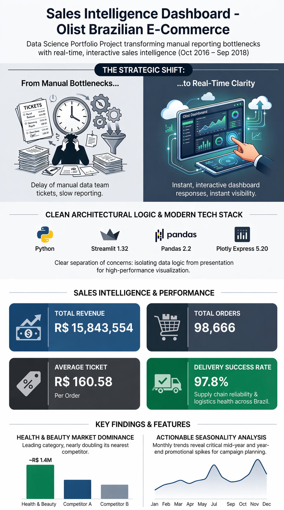

# 🛒 Brazilian E-Commerce Sales Dashboard — Olist




> Interactive sales analytics dashboard built on Brazil's largest public e-commerce dataset — turning 100K+ orders into actionable business intelligence.

---

## 🔗 Live Demo

🔗 **Live Demo:** [View Dashboard](https://olist-sales-dashboard.streamlit.app/)

---

## 🎯 Business Problem

Sales managers need real-time visibility into revenue performance, category rankings, and delivery health — without filing a ticket to the data team every time. This dashboard puts those answers directly in their hands: filter by any date range, get updated KPIs and charts instantly, and move on with the decision.

---

## 📊 Dashboard Features

| Visual | What it answers |
|---|---|
| **KPI Row** (Revenue · Orders · Avg Ticket) | How are we performing right now, in three numbers? |
| **Monthly Revenue Line Chart** | Is the business growing? Where were the peaks and valleys? |
| **Top 10 Categories Bar Chart** | Which product lines drive the most revenue, and by how much? |
| **Order Status Donut Chart** | Are orders reaching customers, or are issues accumulating? |

All four visuals respond to the sidebar **date-range filter** — select any window from Oct 2016 to Sep 2018 and every chart updates simultaneously.

---

## 💡 Key Insights

Over the full two-year dataset (Oct 2016 – Sep 2018), the Olist platform processed **98,666 orders** generating **R$ 15,843,554** in total revenue, with an average ticket of **R$ 160.58** per order.

**Health & beauty leads** the category ranking at ~R$ 1.4M in revenue — nearly double the next-closest category — reflecting strong consumer demand in personal care.

**Logistics performance is a standout**: 97.8% of orders reached a delivered status, confirming that the last-mile supply chain operated reliably at scale throughout the period.

Revenue growth was not linear — the monthly chart reveals clear seasonality spikes, particularly around mid-year and year-end promotional events, offering a targeting signal for future campaign planning.

---

## 🛠️ Tech Stack

| Layer | Library |
|---|---|
| UI & server | [Streamlit](https://streamlit.io) 1.32 |
| Data wrangling | [Pandas](https://pandas.pydata.org) 2.2 |
| Charts | [Plotly Express](https://plotly.com/python/plotly-express/) 5.20 |
| Dataset | [Olist E-Commerce Public Dataset](https://www.kaggle.com/datasets/olistbr/brazilian-ecommerce) |

---

## 🚀 How to Run

```bash
# 1. Clone the repo
git clone <repo-url>
cd sales-dashboard

# 2. Install dependencies
pip install -r requirements.txt

# 3. Add the dataset
# Download the three CSVs from Kaggle and place them in data/:
#   olist_orders_dataset.csv
#   olist_order_items_dataset.csv
#   olist_products_dataset.csv

# 4. Launch the dashboard
streamlit run app.py
```

The app opens at `http://localhost:8501` in your browser.

---

## 📁 Project Structure

```
sales-dashboard/
├── app.py                          # Streamlit UI — layout only, zero business logic
├── utils.py                        # Data loading, merging, and KPI calculations
├── requirements.txt                # Pinned dependencies
├── README.md
└── data/
    ├── olist_orders_dataset.csv
    ├── olist_order_items_dataset.csv
    └── olist_products_dataset.csv
```
