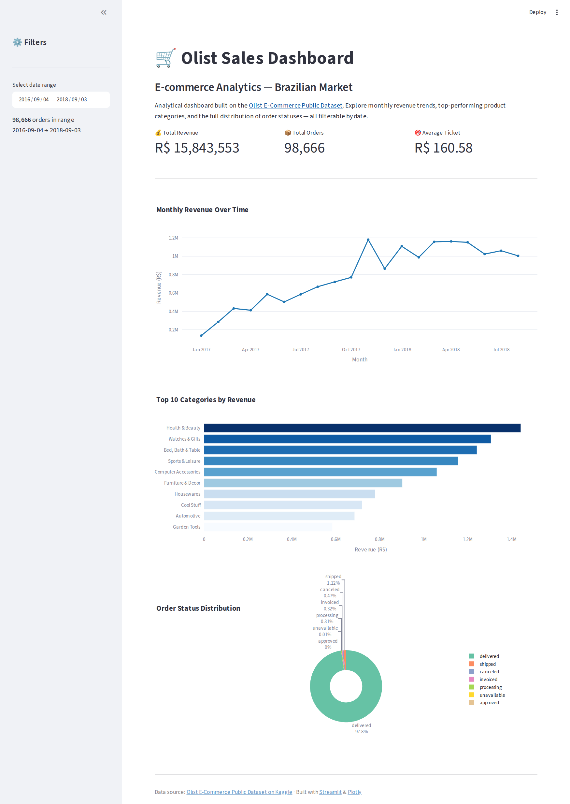

# 🛒 Brazilian E-Commerce Sales Dashboard — Olist




> Interactive sales analytics dashboard built on Brazil's largest public e-commerce dataset — turning 100K+ orders into actionable business intelligence.

---

## 🔗 Live Demo

🔗 **Live Demo:** [View Dashboard](https://olist-sales-dashboard.streamlit.app/)

> The app is hosted on Streamlit Community Cloud and sleeps when idle. If you see a "wake up" screen, click the button and give it ~30 seconds.

---

## 🎯 Business Problem

Sales managers need real-time visibility into revenue performance, category rankings, and delivery health — without filing a ticket to the data team every time. This dashboard puts those answers directly in their hands: filter by any date range, get updated KPIs and charts instantly, and move on with the decision.

---

## 📊 Dashboard Features

| Visual | What it answers |
|---|---|
| **KPI Row** (Revenue · Orders · Avg Ticket) | How are we performing right now, in three numbers? |
| **Monthly Revenue Line Chart** | Is the business growing? Where were the peaks and valleys? |
| **Top 10 Categories Bar Chart** | Which product lines drive the most revenue, and by how much? |
| **Order Status Donut Chart** | Are orders reaching customers, or are issues accumulating? |

All four visuals respond to the sidebar **date-range filter** — select any window from Oct 2016 to Sep 2018 and every chart updates simultaneously.

---

## 💡 Key Insights

Over the full two-year dataset (Oct 2016 – Sep 2018), the Olist platform processed **98,666 orders** generating **R$ 15,843,554** in total revenue, with an average ticket of **R$ 160.58** per order.

**Revenue grew about 8× in one year**, from R$ 137K in January 2017 to over R$ 1.1M per month by early 2018, then plateaued around R$ 1.0–1.15M through August 2018.

**November 2017 is the single highest month (R$ 1.18M)**, driven by Black Friday — a clear signal for campaign and stock planning.

**Revenue is spread across categories, not concentrated.** Health & Beauty leads with R$ 1.44M, but Watches & Gifts (R$ 1.31M) and Bed, Bath & Table (R$ 1.24M) are close behind. No single category dominates, which lowers dependency risk.

**97.8% of orders reached "delivered" status.** Note that delivered is not the same as *on time*: my companion project [olist-delivery-quality-analysis](https://github.com/wgalante/olist-delivery-quality-analysis) shows that late deliveries cut customer review scores by up to 49%.

> **Data note:** the dataset begins and ends with partial months (e.g. September 2018 has only a few orders). Months with fewer than 500 orders are excluded from the trend line so they don't appear as a false revenue collapse. KPIs still use the full date range selected.

---

## 🛠️ Tech Stack

| Layer | Library |
|---|---|
| UI & server | [Streamlit](https://streamlit.io) 1.32 |
| Data wrangling | [Pandas](https://pandas.pydata.org) 2.2 |
| Charts | [Plotly Express](https://plotly.com/python/plotly-express/) 5.20 |
| Dataset | [Olist E-Commerce Public Dataset](https://www.kaggle.com/datasets/olistbr/brazilian-ecommerce) |

---

## 🚀 How to Run

```bash
# 1. Clone the repo
git clone https://github.com/wgalante/sales-dashboard-olist.git
cd sales-dashboard-olist

# 2. Install dependencies
pip install -r requirements.txt

# 3. Launch the dashboard (the three CSVs are already in data/)
streamlit run app.py
```

The app opens at `http://localhost:8501` in your browser.

---

## 📁 Project Structure

```
sales-dashboard-olist/
├── app.py                          # Streamlit UI — layout only, zero business logic
├── utils.py                        # Data loading, merging, and KPI calculations
├── requirements.txt                # Pinned dependencies
├── README.md
└── data/
    ├── olist_orders_dataset.csv
    ├── olist_order_items_dataset.csv
    └── olist_products_dataset.csv
```
